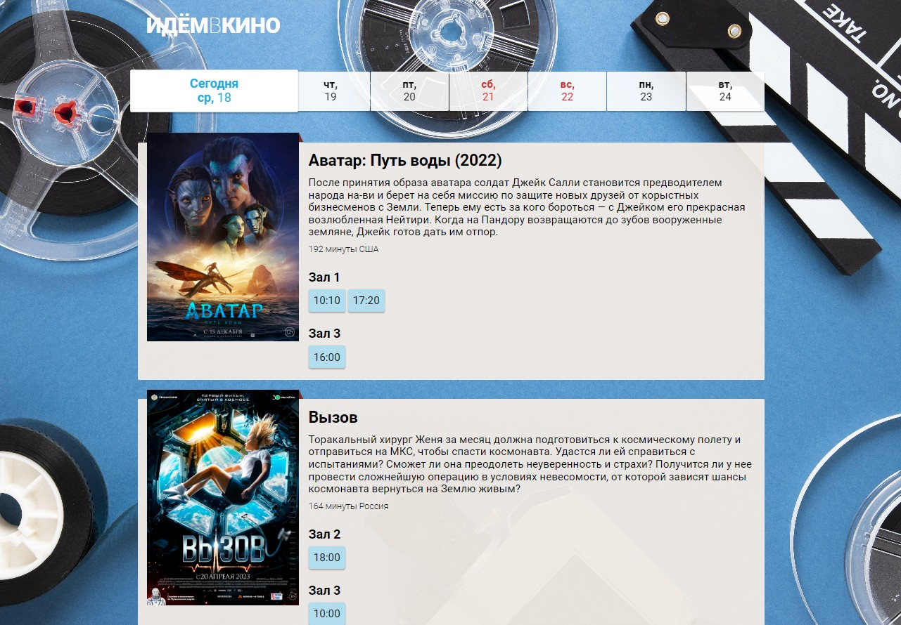

# Создание информационной системы для предварительного бронирования билетов

Дипломный проект курса [**_"JavaScript-программирование для начинающих"_**](https://cat.2035.university/rall/course/18787/?project_id=48). Разработка приложения бронирования билетов онлайн.

## **Сущности**

### _Кинозал_

Помещение, в котором демонстрируются фильмы. Режим работы определяется расписанием на день. Зал — прямоугольный, состоит из N\*M различных зрительских мест.

### _Зрительское место_

Место в кинозале. Зрительские места могут быть VIP и обычные.

### _Фильм_

Информация о фильме заполняется администратором. Фильм связан с сеансом в кинозале.

### _Сеанс_

Сеанс — это временной промежуток, в котором в кинозале будет показываться фильм. На сеанс могут быть забронированы билеты.

### _Билет_

QR-код c уникальным кодом бронирования, в котором обязательно указаны место, ряд, сеанс. Билет действителен строго на свой сеанс. Для генерации QR-кода использован [QRCreator.js](https://github.com/slesareva-gala/QR-Code)

## **Роли пользователей системы**

**Гость** — неавторизованный посетитель сайта

### _Возможности гостя_

- просмотр расписания
- просмотр информации о фильмах
- выбор места в кинозале
- бронирование билета

## **Описание проекта**

- Доработана исходная верстка и адаптирована под планшетные и мобильные устройства. Верстка корректно отображается на устройствах с шириной экрана 320px и более.
- Разработана API для взаимодействия с Backend.
- Реализовано получение списков всех залов, кинофильмов и сеансов, а также актуальной схемы посадочных мест на выбранный сеанс
- Реализован заказ билетов
- Запрограммирована гостевая часть сайта

## **Стек технологий**

## [**Демо**](https://alekseeva-t-v.github.io/go-to-the-cinema/)

